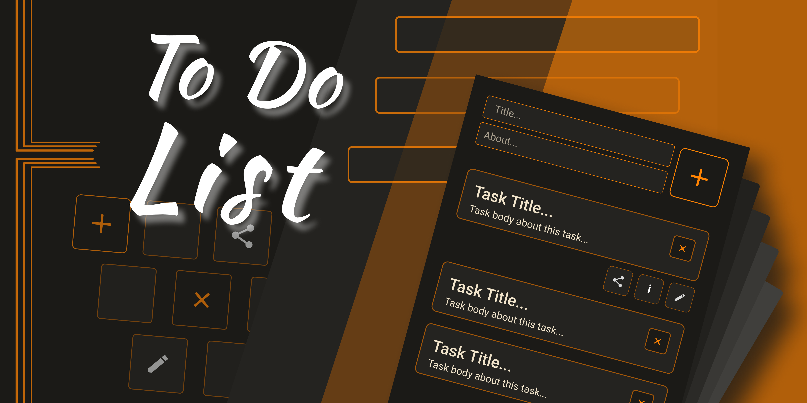

# To-Do List Application



This is a modern To-Do List application built using React, TypeScript, Redux, and Yarn. The application allows users to add, edit, delete tasks, and manage their to-do list interactively with the added feature of drag-and-drop task reordering.

## Features

- **Add Tasks**: Users can add new tasks with a title and description.
- **Edit Tasks**: Users can modify the title or description of existing tasks.
- **Delete Tasks**: Users can remove tasks from the list.
- **Task Focus**: Visual indication when a task or input field is focused for a more user-friendly experience.
- **Modular SCSS**: Styles are structured using SCSS with variables, mixins, and a clean structure for easier maintenance.
- **Interactive UI**: Responsive design with buttons and form inputs that respond to user actions.
- **Drag-and-Drop Reordering**: Tasks can be reordered by dragging and dropping them.
- **Responsive Design**: The application is designed to work seamlessly on various screen sizes.

## Technologies Used

- **HTML**: Structure of the application.
- **SCSS**: Styling of the application with the use of variables and mixins.
- **TypeScript**: Typed JavaScript for enhanced code quality and maintainability.
- **React**: JavaScript library for building user interfaces.
- **Redux**: State management library for managing application state.
- **Yarn**: Package manager for managing project dependencies.
- **dnd-kit**: A library for creating drag-and-drop interfaces.
- **react-modal**: A library for creating modal windows.
- **Vite**: A fast build tool for modern web projects, used to serve and bundle the application.
- **ESLint**: A tool for identifying and fixing problems in JavaScript code, ensuring code quality and consistency.
- **Prettier**: A code formatter that enforces a consistent style across the project.

## How to Run

1. Clone the repository:

   ```bash
   git clone https://github.com/yourusername/todo-app.git
   cd todo-app
   ```

2. Install dependencies:

   ```bash
   yarn install
   ```

3. Start the development server using Vite:

   ```bash
   yarn dev
   ```

4. Open your browser and navigate to http://localhost:5173 to view the application.

## Folder Structure

```bash
src/
│
├── components/          # Reusable components (e.g., Task, Modal, etc.)
├── redux/               # Redux store, actions, reducers
├── styles/              # SCSS styles
├── utils/               # Utility functions
└── App.tsx              # Main App component
```
